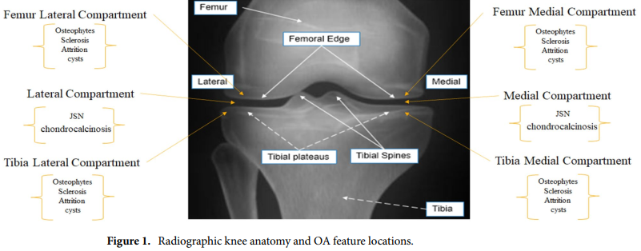
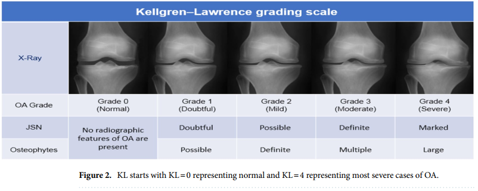

# Interpretable and parameter optimized ensemble model for knee osteoarthritis assessment using radiographs
使用射线照片评估膝关节骨关节炎的可解释和参数优化的集成模型

Knee osteoarthritis (KOA) is an orthopedic disorder with a substantial impact on mobility and quality of life. An accurate assessment of the KOA levels is imperative in prioritizing meaningful patient care. Quantifying osteoarthritis features such as osteophytes and joint space narrowing (JSN) from low-resolution images (i.e., X-ray images) are mostly subjective. We implement an objective assessment and quantification of KOA to aid practitioners. In particular, we developed an interpretable ensemble of convolutional neural network (CNN) models consisting of three modules. First, We developed a scale-invariant and aspect ratio preserving model to localize Knee joints. Second, we created multiple instances of "hyperparameter optimized" CNN models with diversity and build an ensemble scoring system to assess the severity of KOA according to the Kellgren-Lawrence grading (KL) scale. Third, we provided visual explanations of the predictions by the ensemble model. We testd our models using a collection of 37996 Kneee joints from the Osteoarthritis Initiative (OAI) dataset. Our results show a superior (13-27%) performance improvement compared to the state-of-the-art methods

膝关节骨关节炎 (KOA) 是一种骨科疾病，对活动能力和生活质量有重大影响。准确评估 KOA 水平对于优先考虑有意义的患者护理至关重要。从低分辨率图像（即 X 射线图像）量化骨赘和关节间隙变窄 (JSN) 等骨关节炎特征大多是主观的。我们对 KOA 进行客观评估和量化，以帮助从业者。特别是，我们开发了一个由三个模块组成的卷积神经网络 (CNN) 模型的可解释集合。首先，我们开发了一个尺度不变和纵横比保留模型来定位膝关节。其次，我们创建了多个具有多样性的“超参数优化”CNN 模型实例，并构建了一个集成评分系统，以根据 Kellgren-Lawrence 分级 (KL) 量表评估 KOA 的严重程度。第三，我们提供了集成模型预测的视觉解释。我们使用来自骨关节炎倡议 (OAI) 数据集的 37996 个膝关节的集合来测试我们的模型。与最先进的方法相比，我们的结果显示出卓越的 (13-27%) 性能提升

Osteoarthritis (OAI) is a common form of degenerative joint disorder characterized by functional impairment and chronic pain. OA has a profound impact on the economy, individuals, and society. The economic direct and indirect burden in the US is estimated at around $100 billion. OA affects 12.1% (32.5 million) of the adult population and is considered the 5th cause of disability in the US. It ranked in 2013 as the second most costly condition to treat in US hospitals after Septicemia. The social burden of OA is represented by the increasing functional impairments and loss of independence in older communities

骨关节炎 (OAI) 是一种常见的退行性关节疾病，其特征是功能障碍和慢性疼痛。 OA 对经济、个人和社会产生深远的影响。 美国的经济直接和间接负担估计约为 1000 亿美元。 OA 影响了 12.1%（3250 万）的成年人口，在美国被认为是导致残疾的第五大原因。 它在 2013 年被列为仅次于败血症的美国医院治疗费用第二高的疾病。 OA 的社会负担表现为老年社区日益严重的功能障碍和丧失独立性

KOA is the most prevalent type of OA and represents the 11 th cause leading to disability. The degenerative nature of KOA imposes increasing costs upon patients ($4000-$5000 for moderate levels of KOA to $800-$1000 for severe cases of KOA). KOA is more pervalent among two categories, the first, females aged 60 years or more when compared to males of the same age. The second category includes all younger people characterized by obesity.

KOA 是最常见的 OA 类型，是导致残疾的第 11 位原因。 KOA 的退行性增加了患者的成本（中等程度的 KOA 为 4000-5000 美元，严重的 KOA 为 800-1000 美元）。 KOA 在两类中更为普遍，第一类是 60 岁或以上的女性与同龄男性相比。 第二类包括所有以肥胖为特征的年轻人。

In general, diagnosed cases with KOA shows a marginally positive association with age wan weight.

一般而言，诊断出的 KOA 病例与年龄体重呈略微正相关。

Physicians rely on radiographs and patient clinical records to assess the KOA severity level. Radiographic images are the primary means to determine the class of osteoarthritis and will be used for a long time due to many reasons that include affordability and availability. The low-resolution radiographs limit the physicians ability to quantify the joint OA abnormalities: JSN, Sclerosis, Cyst, Attrition, Chondrocalcinosis, and Osterphytes. 

医生依靠 X 光片和患者临床记录来评估 KOA 的严重程度。 射线照相图像是确定骨关节炎类别的主要手段，由于包括负担能力和可用性在内的许多原因，将被长期使用。 低分辨率射线照片限制了医生量化关节 OA 异常的能力：JSN、硬化、囊肿、磨损、软骨钙质沉着症和骨赘。

In KOA, JSN , Chondrocalcinosis, and Attrition are quantified at the lateral compartment and medial compartment. JSN and attrition are graded based on Osteoarthritis Research Society International (OARSI) with a four-level grading system. In contrast, chondrocalcinosis is graded based on OARSI with a two-level grading system. All other OA features are detected/quantified at four points: the lateral femur compartment, medial femur compartment, tibia lateral compartment, and bibia medial compartment. Osteophytes and Sclerosis are graded based on OARSI with a four-level grading system. Meanwhile, the syst is graded based on OARSI with a two-level grading system (Fig1) for feature location.

在 KOA 中，JSN、软骨钙质沉着症和磨损在外侧隔室和内侧隔室量化。 JSN 和损耗根据国际骨关节炎研究协会 (OARSI) 进行分级，采用四级分级系统。 相比之下，软骨钙质沉着症根据 OARSI 分级，采用两级分级系统。 在四个点检测/量化所有其他 OA 特征：外侧股骨隔室、内侧股骨隔室、胫骨外侧隔室和双骨内侧隔室。 骨赘和硬化基于 OARSI 进行分级，采用四级分级系统。 同时，该系统基于 OARSI 进行分级，具有用于特征定位的两级分级系统（图 1）。

In the process of scoring KOA, Physicians map quantified features from X-ray images (Osteophytes and JSN) into a 5level grading system based on the KL grading scale. Grade 0 corresponds to the normal knee, Grade 1 corresponds to doubtful KOA, Grade 2 corresponds to mild KOA, Grad 3 corresponds to moderate KOA, and Grade corresponds to server case of KOA (Fig.2)

在对 KOA 进行评分的过程中，医生将来自 X 射线图像（骨赘和 JSN）的量化特征映射到基于 KL 分级量表的 5 级分级系统中。 0级为正常膝关节，1级为可疑KOA，2级为轻度KOA，3级为中度KOA，Grade对应KOA的服务器病例（图2）

Since the 1950s, researchers have used different methods to quantify the KOA severity from radiographs. In general, we can group most of the semi-automated methods into three categories. The geometric approaches utilize variants of image processing techniques such as edge and contour detectors, vertical intensity profiling, as Sclerosis, cyst, attrition, chondrocalcinosis, and osteophytes. That motivated researchers to turn to classical machine learning and pattern recognition algorithms for KOA severity assessment to improve the assessment accuracy. They utilized methods such as (but are not limited to): Self-organizing Map (SOM), Weighted neighbor distance using the compound hierarchy of algorithms representing morphology (WND-CHARM) using features like Gray Level Co-occurrence Matrix (GLCM), histogram of oriented gradients (HOG), Multi-scale Histograms, Zernike moment, First Four Moments, Tamura Texture, and Chebyshev Statistics. In general, this approach failed to match the performance a achieved by radiographs expert readers.

自 1950 年代以来，研究人员使用不同的方法从 X 光片中量化 KOA 的严重程度。一般来说，我们可以将大多数半自动化方法分为三类。几何方法利用图像处理技术的变体，例如边缘和轮廓检测器、垂直强度分析，如硬化、囊肿、磨损、软骨钙质沉着症和骨赘。这促使研究人员转向经典机器学习和模式识别算法进行 KOA 严重性评估，以提高评估准确性。他们使用的方法包括（但不限于）：自组织映射 (SOM)、使用表示形态的算法的复合层次结构 (WND-CHARM) 的加权邻域距离，使用灰度共生矩阵 (GLCM) 等特征，定向梯度直方图 (HOG)、多尺度直方图、泽尼克矩、前四矩、田村纹理和切比雪夫统计。一般而言，这种方法无法与射线照片专家阅读器所达到的性能相匹配。

Since the 2010s, with the rise of deep learning (DL) ...

To the best of our knowledge, this is the first study to design and implement a reliable, interpretable, parameter optimized, and fully automated CNN-based model for KOA severity assessment based on radiographs from all six clinical visits in the OAI. Our systematic approach implements: i) data preprocessing to enhance radiographs, 2) data augmentation to increase the number of images used for training purposes, 3) modify single shot multi-box detector (SSD) to localize knee joints with high accuracy, 4) address class imbalance to obtain optimal bias-variance trade-off, 5) assess the severity of KOA using stacked CNN-based ensemble model, and locate OA features using Eigen-CAM. The proposed approach is not disease-specific and is expected to be equally suitable fo rmdeling any other disease if similar care is taken in data processing and building parameter-optimized interpretable models.

据我们所知，这是第一项基于 OAI 中所有六次临床就诊的 X 光片设计和实施基于 CNN 的可靠、可解释、参数优化和全自动模型的研究，用于 KOA 严重程度评估。 我们的系统方法实现：i) 数据预处理以增强 X 光片，2) 数据增强以增加用于训练目的的图像数量，3) 修改单次多框检测器 (SSD) 以高精度定位膝关节，4) 解决类别不平衡以获得最佳偏差-方差权衡，5) 使用基于堆叠 CNN 的集成模型评估 KOA 的严重性，并使用 Eigen-CAM 定位 OA 特征。 所提出的方法不是特定于疾病的，如果在数据处理和构建参数优化的可解释模型中采取类似的措施，预计同样适用于处理任何其他疾病。